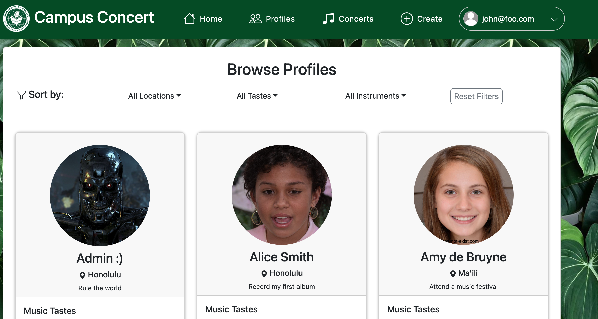

Campus Concerts is a project developed by 6 students in the UH ICS 314 Software Engineering class. 
It incorperates the UH system and brings togther musically inclined people to create a site which makes it easy to connect with those that would like to play music together. It was worked on over the course of ~4 weeks with 1 week of planning and the subsequent 3 being layed out in a Milestone format. Following project development guidelines, each memeber worked on specfic tasks during the creation of the website.    

<pre>

  In this project I worked together with fellow CS students to create a system that would 
  register students or faculty of the UH campuses allow them ways to share not only what instruments 
  they played but also a chat and invite service that would enable them to connect should they 
  wish to engage in "Jam sessions", or inpromptu music collaborations.   

  For each week of the creation process all of the team members would pick parts of the project to work on
  and bring together in a typical software team fashion. During the first milestone I worked on creating the pages 
  for "Browsing Profiles" as well as the "Admin Home Page" and fixed multiple routing issues for the different pages.  
  For later milestones I helped corrected errors during log in where different types of users would get the same
  homepage, which shouldn't have been the case in our planned designed. Also I noticed that a signed in user could 
  navigate back the the "Sign in page" if they press the clickable logo in the navbar. In most sites I've used the
  clickable logo just routes to the homepage if the user is logged in. So I changed it to that.

  

  

  This entire developmental process opened my eyes to how a team of software engineers can work together to
  create a product, whether that be an application or a funcational web page. Before this, my familiartiy with GitHub
  collaborations was limited. Now I have a much more fleshed out understanding of the Commit and Issues-XX purposes
  when working on a project, and why not everything gets worked on in main. Overall this was a very enjoyable process 
  and it was exciting seeing the page come to life bit by bit with everyone's contirbutions.   
  

  
</pre>

